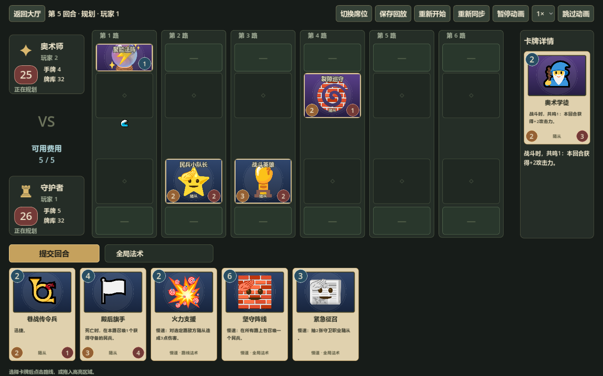
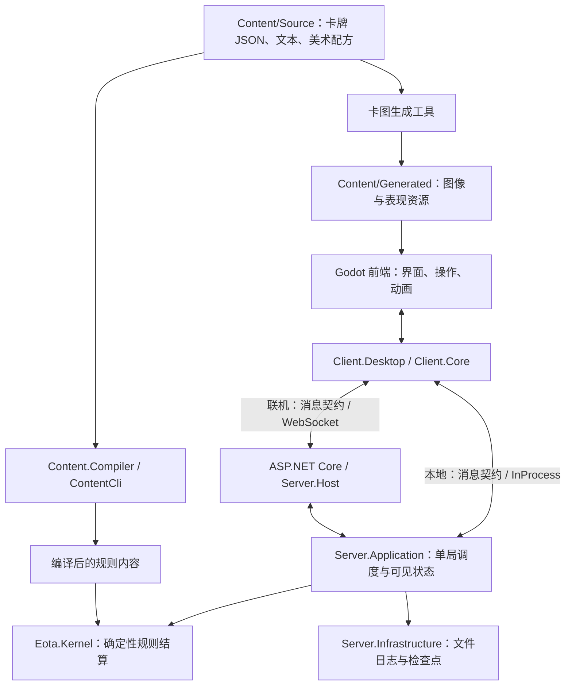

# EOTA v2 · Embers of the Arcane

**EOTA v2** 是一款以多路战场、双方秘密规划和自动结算为核心的双人策略卡牌游戏。你需要构筑牌组，把随从、场地和法术安排到合适的路线，在守住己方英雄的同时突破对手防线。

第一次游玩，建议从 **[新手教程：从第一局到完整规则](Docs/BeginnerGuide.zh-CN.md)** 开始。

## 世界观

**末法时代，魔力枯竭。以太正在不可逆转地消散**，昔日统治世界的魔法师，如今连施放一颗小火球都无比艰难。与此同时，兽潮愈演愈烈，人类被迫放弃广袤疆土，退守少数由上古符文加固的城邦。文明的火种摇曳不定，只余点点余烬。

城墙内外，各方势力为生存、权力与信仰重新角逐。魔法师协会试图唤醒沉睡的以太，普通守卫开始质疑旧日统治者的权威；猎人维系着城邦与荒野的生命线，工匠则从废墟中挖掘曾被魔法师封杀的蒸汽文明。远离城邦的暗黑教团以灵魂治病，驱使僵尸与骷髅，却似乎从未受魔力衰退影响，其力量与兽潮之间的联系仍是令人不安的谜团。

| 势力 | 在世界中的位置 | 分支势力 |
| --- | --- | --- |
| 奥术师 · 魔法师协会 | 城邦名义上的掌权者，通过遗物与法阵维系魔法的荣光 | 以鲜血和生命施法的血魔法师 |
| 守卫 · 城邦护卫 | 由普通人组成的防线，在协会衰落之际争取决定自身命运的权力 | 倡导火枪、火炮与炸药的火器营 |
| 猎人 · 猎人公会 | 活跃在文明边界之外，借助野兽、陷阱与剧毒在荒野求生 | 与兽群建立灵魂纽带的兽灵行者 |
| 工匠 · 蒸汽革命者 | 蒸汽文明的后裔，靠考古复兴失落的机械科技 | 融合魔法回路与机械的魔能工匠 |
| 灵魂使 · 暗黑教团 | 在荒野提供庇护，也因操纵灵魂与生死而招致恐惧 | 吞噬灵魂、追求自身永恒的永生者 |
| 佣兵 · 中立势力 | 接受各方雇佣，在乱世中以活着和收钱为信条 | — |

在这魔法的余烬之中，谁将燃起新的火焰？完整设定见 **[核心世界观](Docs/Worldbuilding.zh-CN.md)**。

当前可玩的卡池包含奥术师、守卫、猎人、工匠、灵魂使五个职业与中立卡。灵魂使以亡灵留场、死亡契约、主动牺牲和治疗转伤害为主要玩法。当前版本为 **1.1.0-pre-release**，卡池与规则仍在迭代，平衡性仍需实战检验。

## 怎么玩

默认对局有 **6 条路线**，双方英雄各有 **30 点生命**。每位玩家使用一套 **40 张牌**的牌组，每种卡最多 **3 张**；正常构筑允许本职业与中立卡。

每回合先用有限费用规划部署与施法，提交后由游戏依次处理入场效果、快速法术、移动、充能、战斗、慢速法术和回合末效果。随从会根据所在路线自动交战；对面没有能防守的随从时，攻击会落到英雄身上。将敌方英雄击败即可获胜，同一结算帧中双方英雄都死亡则为平局。

| 职业 | 卡图配色 | 主要玩法 |
| --- | --- | --- |
| 守卫 | 蓝色 | 民兵动员、守备据点、火器营与防线调度 |
| 奥术师 | 紫色 | 准备各路以太，通过共鸣强化随从与法术 |
| 工匠 | 棕色 | 蓄能、充能、机械启动与废料替换 |
| 猎人 | 绿色 | 兽群协同、自动移动、陷阱与毒伤消耗 |
| 中立 | 灰棕色 | 为各职业补充费用曲线与针对手段 |

当前包含 **282 张卡牌**：五职业各 50 张基础卡，每职业另有 2 张衍生卡，加上 22 张中立卡；共 272 张可构筑基础卡，并提供 **15 套职业体系模板**。

## 开始游戏

1. 从 [Releases](https://github.com/NullaDev/EOTA-v2/releases) 获取 Windows x64 发布包，将 ZIP **完整解压**。
2. 双击 `EOTA.exe`，保留同目录下的运行库、资源和服务端文件。发布包无需另外安装 Godot 编辑器或 .NET SDK。
3. 进入“人机对战”，选择双方牌组，将 AI 难度设为“简单”，使用默认对战协议开始第一局。
4. 遇到不熟悉的卡牌或状态时，查看卡牌详情，并对照 [新手教程](Docs/BeginnerGuide.zh-CN.md) 阅读。

游戏还提供本机双人、开房联机、牌组工坊、卡牌图鉴、对局回放和卡牌编辑器。两人使用同一台电脑时，通过“切换席位”的交接界面轮流操作；远程对战则由一方开房，另一方使用邀请地址加入。

## 前后端架构

项目以 **Godot 4.6.2 .NET** 提供桌面前端，以 **C# / .NET 8 + ASP.NET Core** 提供独立服务端。两者共享消息契约，所有正式规则结算都由纯 C# 的 `Eota.Kernel` 完成。本机双人和人机对战会在客户端进程内运行同一套服务端应用与内核；联机时则连接独立服务端。

下面展示运行时的主要调用与数据流：

| 层次与目录 | 职责 |
| --- | --- |
| [Godot 前端](Client/Godot) | 大厅、战场、卡牌详情、拖拽与动画；把玩家操作转换为命令，展示服务端返回的结果 |
| [桌面应用层](src/Eota.Client.Desktop)、[客户端核心](src/Eota.Client.Core) | 管理牌组、协议、内容编辑、房间与回放；维护当前玩家可见的状态、消息顺序和动画队列 |
| [人机策略](src/Eota.Client.AI) | 根据玩家视角下的信息与合法操作提示选择行动，通过客户端提交命令 |
| [消息契约](src/Eota.Transport.Contracts)与传输适配器 | 定义版本化 JSON 消息；客户端的 [WebSocket](src/Eota.Client.Transport.WebSocket) 与 [InProcess](src/Eota.Client.Transport.InProcess) 适配器提供联机和本地通道 |
| [服务端入口](src/Eota.Server.Host)、[WebSocket 接入](src/Eota.Server.Transport.WebSocket) | 托管独立房间，提供房间查询、加入准备和实时对局连接 |
| [服务端应用层](src/Eota.Server.Application) | 每局通过 `MatchActor` 串行处理命令，校验席位与版本、去重，并按玩家视角生成可见状态与表现事件 |
| [服务端基础设施](src/Eota.Server.Infrastructure) | 加载内容、管理房间与计时，使用文件命令日志和检查点保存、恢复对局 |
| [规则内核](src/Eota.Kernel) | 处理费用、阶段、效果、战斗、随机与胜负；通过快照、效果意图和统一结算生成新状态，不依赖 Godot、网络或存储 |
| [内容编译器](src/Eota.Content.Compiler)、[内容工具](tools/Eota.ContentCli)、[回放工具](tools/Eota.ReplayCli) | 校验卡牌定义、编译规则、生成卡表，并使用同一内核重放命令、校验结果 |

客户端收到的是自己有权看到的信息：对手手牌内容、牌库顺序等隐藏状态由服务端保管。联机断开后可重新获取可见状态并恢复表现；服务端则通过命令日志与检查点恢复权威对局。动画的暂停、倍速和跳过只改变观看方式，不改变结算结果。

卡牌规则、本地化和美术配方分别维护在 [Content/Source](Content/Source)，生成文件位于 [Content/Generated](Content/Generated)。相同规则、种子与命令序列用于确定性重放；更多实现边界见 [总体架构](Docs/Architecture.zh-CN.md) 与 [规则决策记录](Docs/ADR/README.md)。

## 一起完善 EOTA

希望每一位玩家都来贡献自己的想法：一张想玩的卡、一个有趣的职业机制、一段势力故事，或是一场让你觉得不公平的对局，都可以成为项目改进的起点。欢迎通过 [Issues](https://github.com/NullaDev/EOTA-v2/issues) 分享建议、反馈问题，也欢迎提交 [Pull Request](https://github.com/NullaDev/EOTA-v2/pulls)。

- **玩法与平衡**：说明卡牌、牌组和使用场景，附上对局回放或复现步骤，方便一起讨论。
- **世界观与卡牌设计**：提出故事、角色、卡牌效果或新体系；可以先讨论想法，再参考 [卡牌设计与 JSON 指南](Docs/CardJsonDesignGuide.zh-CN.md) 制作内容。
- **美术、文档与代码**：改进插图、界面、教程与翻译，修复问题，完善客户端、服务端和工具。

欢迎从小改动开始。提交贡献时请注明引用素材的来源与许可，项目原创贡献沿用下述 GPLv3 协议。

## 开源协议

Copyright (C) 2026 EOTA contributors.

本项目的原创代码、工具、文档与游戏内容采用 **GNU General Public License v3.0（GPL-3.0-only）**，完整条款见根目录 [LICENSE](LICENSE)。你可以依照协议使用、修改和再分发；分发本项目或其修改版本时，应保留许可声明，并按照 GPLv3 提供对应源码。项目按许可证所述不提供担保。

第三方组件与素材保留各自的版权和许可，不因本项目采用 GPLv3 而改变。例如 Godot、.NET 运行组件、[emoji-mixer 兼容数据](tools/EmojiArt/vendor/README.zh-CN.md)，以及来自 Google Emoji Kitchen 的[融合图像](Content/Source/Art/Fusions/README.zh-CN.md)；其中融合图像及生成卡图中包含的第三方图像部分不在本项目原创内容的 GPLv3 授权范围内。

## 继续了解

| 想了解的内容 | 文档 |
| --- | --- |
| 末法时代、城邦与六方势力的完整设定 | [核心世界观](Docs/Worldbuilding.zh-CN.md) |
| 第一局操作、完整回合流程、战斗与关键词 | [新手教程](Docs/BeginnerGuide.zh-CN.md) |
| 全部卡牌的数值和效果 | [中文卡表](Docs/CardTable.zh-CN.md) |
| 五职业的体系思路与现成牌组 | [十五套体系牌组](Docs/Content/ArchetypeDecks.zh-CN.md) |
| 卡组管理、对战协议、疲劳与联机确认 | [客户端与房间规则](Docs/GameplayGuide.zh-CN.md) |
| 制作自定义卡牌和内容包 | [Mod 开发者 JSON 指南](Docs/CardJsonDesignGuide.zh-CN.md) |
| 从源码制作 Windows 发布包 | [Windows 打包说明](Docs/WindowsRelease.zh-CN.md) |
| 各开发工具与内容制作流程 | [开发工具与内容制作](tools/README.zh-CN.md) |
| 规则内核、服务端与客户端如何协作 | [项目架构](Docs/Architecture.zh-CN.md) |

仅游玩时使用发布包即可；修改源码需要 Godot .NET 版与 .NET SDK。卡图制作与内容构建工具保留在开发仓库中，使用方式见 [开发工具与内容制作](tools/README.zh-CN.md)。
